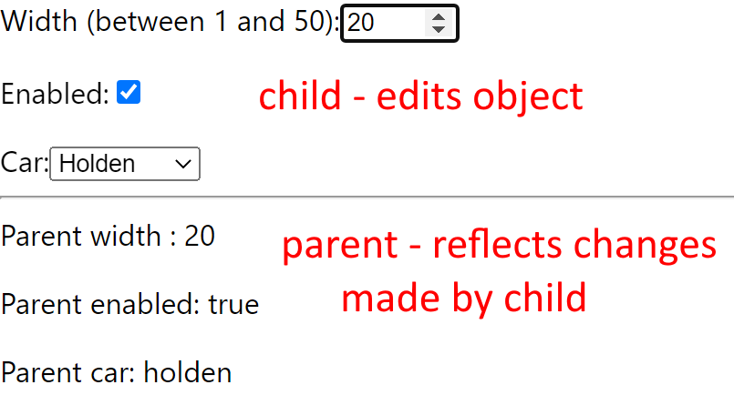

# Parent-child Components in React


## Problem
- _parent_ component passes an object to a _child_ component:
```json
{ 
    width: 20, 
    isEnabled: true
}
```
- _child_ component edits object
- changes reflected in _parent_ component

## Solution
- _parent_
  - pass update function to _child_
  ```javascript
  const UpdateItem = (name, val) =>
  {
    setItem((prevState) => ({
      ...prevState,
      [name]: val,
    }));
  }

        <Child item={item} updateItem={UpdateItem} />
  ```
- _child_
  - changing state via `setItem` is asynchronous
  - must use `useEffect` which is called **after** state has changed
  - in `useEffect`, call _parent_ update function
  ```javascript
  useEffect(() => {
    props.updateItem("width", item.width);
  }, [item.width]);
  ```

## Discussion
- handling a _checkbox_ requires using the `checked` property

  ```javascript
  const OnChangeChecked = (e) => {
    const { name, checked } = e.target;
    setItem((prevState) => ({
      ...prevState,
      [name]: checked,
    }));
  ```

## Further work
- convert to Typescript
- test with other input types
  - radio button group
  - ~~select aka dropdown list~~

## Prerequisites
- nodejs

## Getting started
```bash
$ git clone https://github.com/TrevorDArcyEvans/parent-child
$ cd parent-child
$ npm install
$ npm start
```


